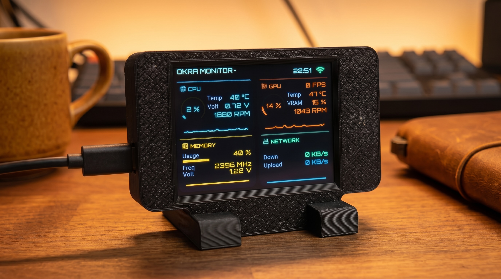

# OKRA Monitor

OKRA Monitor 固件，运行在 CYD（Cheap Yellow Display）2.8" 320×240 ILI9341 屏幕上，实时显示 PC 硬件监控仪表盘（CPU / GPU / 内存 / 网络），数据通过 SSE 长连接从配套 PC 服务器获取。WiFi 通过微信小程序完成配网，无需硬编码 SSID。

- 屏幕 UI：LVGL 8.4
- 显示驱动：TFT_eSPI
- 蓝牙配网：NimBLE
- 数据解析：ArduinoJson + 自定义 SSE 解析器

<div align="center"></div>

---


## 构建与烧录

> **在线烧录**：无需本地编译，打开烧录页面：<https://okraworks.cn/okramonitor_install>，按页面提示通过 USB 一键烧录。

不想自己编译的话用上面的在线烧录即可。需要在本地编译的，继续往下看。

需要 PlatformIO CLI（`pip install platformio` 或 VS Code 的 PlatformIO 插件，我使用过的是后者）。

```bash
pio pkg install              # 安装依赖库
pio run                      # 编译
pio run --target upload      # 烧录
pio device monitor           # 串口监视器
```

`pio run` 打印 `[SUCCESS]` 即编译通过。

---

### 微信小程序配网

微信扫码使用配套小程序完成配网（手机蓝牙需开启）：

<div align="center"></div>


配置写入后设备会自动重连；开机按提示操作可清除配网信息。

---

## 数据源 / 配套服务器

WiFi 连上后，固件向服务器发起 SSE 长连接：

| key | 含义 |
|-----|------|
| `cpu_usage` | CPU 使用率 (%) |
| `cpu_temp` | CPU 温度 (°C) |
| `cpu_fun` | CPU 风扇转速 (%) |
| `cpu_volt` | CPU 电压 (V) |
| `gpu_core_usage` | GPU 核心使用率 (%) |
| `gpu_temp` | GPU 温度 (°C) |
| `gpu_vram_usage` | GPU 显存使用率 (%) |
| `gpu_fun` | GPU 风扇转速 (%) |
| `fps` | 帧率 |
| `mem_usage` | 内存使用率 (%) |
| `mem_freq` | 内存频率（固件内部会 ×2 显示） |
| `mem_volt` | 内存电压 (V) |
| `net_down` | 网络下行速率 |
| `net_up` | 网络上行速率 |

> 硬件数据通过 **AIDA64** 采集，并由配套 PC 服务器按上面的 SSE 格式推流。配置说明与配置文件下载见 <https://okraworks.cn/article/Okra_Monitor/>。没有服务器时，设备能正常启动、连上 WiFi，但仪表盘无数据。

---

## NTP 时间同步

设备连上 WiFi 后从 `ntp.aliyun.com`、`ntp.tencent.com`、`pool.ntp.org` 同步时间，时区固定为 UTC+8（中国时区）。

---

## 打包合并固件（用于网页刷机）

`pio run` 编译后，运行打包脚本生成单个合并固件：

```bash
./update_firmware.sh          # 默认版本号 1.1
./update_firmware.sh 1.2      # 指定版本号
```

脚本用 `esptool` 把 bootloader + 分区表 + app 合并成 `firmware/firmware.bin`，并生成 `manifest.json`。可用 esptool 直接刷：

```bash
esptool.py -p /dev/cu.usbserial-XXXX write-flash 0x0 firmware/firmware.bin
```

如需网页一键刷机（ESP Web Tools），需自行准备一个引用 `manifest.json` 的 `install.html`（本仓库未含）。

---

## 故障排查

| 现象 | 排查 |
|------|------|
| 白屏 / 花屏 / 颜色错 | 检查 [lib/TFT_eSPI/User_Setup.h](lib/TFT_eSPI/User_Setup.h) 的驱动是否为 `ILI9341_2_DRIVER`、引脚是否正确，确认 [platformio.ini](platformio.ini) 的 `-include` 行还在 |
| 触摸位置偏 | 开机时按提示操作，清空 NVS，重新进行两点触屏校准（校准数据存 NVS `touch` 命名空间） |
| WiFi 连上但无数据 | 说明配套服务器没运行或 `server_ip` 错误；看串口日志 `SSE 开始连接: <ip>:1919/sse` |
| 中文字符/图标显示成方框 | 确认 [src/fonts/](src/fonts/) 下 6 个 `.c` 字体文件齐全（在 `src/` 下会自动编译） |
| 串口无输出 / 乱码 | 波特率应为 115200；若用某些 ESP32 板子需检查 `ARDUINO_USB_CDC_ON_BOOT` 设置 |

---

## 声明

> 本仓库代码由 AI 辅助生成。

---

## License

MIT，详见 [LICENSE](LICENSE)。
